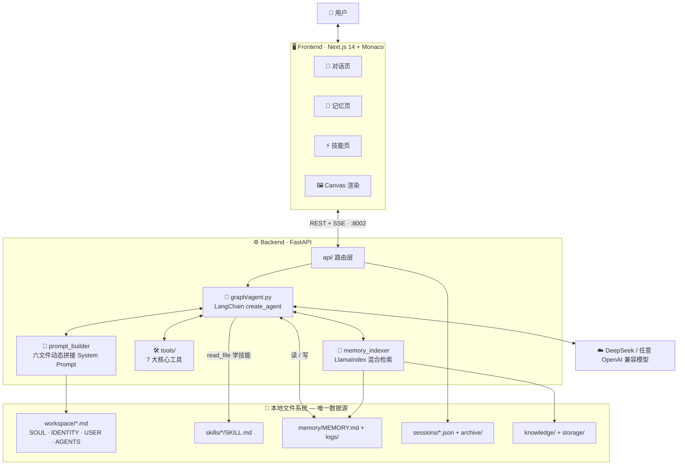

<div align="center">

# 🦞 WeatherCore-OpenClaw

**一个把「记忆」与「技能」都还给文件的透明 AI Agent 系统**

*File-first Memory · Skills as Plugins · Zero Black Box*

[](https://www.python.org/)
[](https://fastapi.tiangolo.com/)
[](https://github.com/langchain-ai/langchain)
[](https://nextjs.org/)
[](https://www.typescriptlang.org/)
[](./LICENSE)
[](./FuFan-OpenClaw%20%E5%BC%80%E5%8F%91%E9%9C%80%E6%B1%82%E6%96%87%E6%A1%A3%20(PRD).md)

</div>

---

> ### 💭 它不做平台，只做你的数字副手
> WeatherCore-OpenClaw 是一个基于 Python 重构的轻量级 AI Agent 系统，复刻并优化 OpenClaw（原名 Moltbot/Clawdbot）的核心体验。
> 没有向量数据库黑盒，没有不可见的提示词魔法 —— **你的每一次对话、Agent 的每一次反思，都是一行人类可读的 Markdown。**

---

## ✨ 三大设计支柱

|                                                     🗂️ 文件即记忆                                                      |                                              🧩 技能即插件                                               |                                                     🔍 全程透明                                                      |
| :-------------------------------------------------------------------------------------------------------------------: | :-----------------------------------------------------------------------------------------------------: | :-----------------------------------------------------------------------------------------------------------------: |
| 摒弃不透明的向量数据库，回归最通用的 Markdown/JSON 文件系统。记忆直接躺在 `memory/MEMORY.md` 里，随时打开、随时编辑。 | 遵循 Anthropic Agent Skills 范式，一个文件夹 + 一份 `SKILL.md` 就是一项能力，**拖入即用**，零代码注册。 | System Prompt 拼接逻辑、工具调用链、记忆读写过程全部可见。前端 **Raw Messages 面板**让你实时审视 Agent 的一举一动。 |

## 🚀 功能全景

- 💬 **流式对话** — SSE 逐 Token 输出，工具调用、RAG 检索、Canvas 内容全程事件化推送
- 🧠 **持久记忆系统** — `MEMORY.md` 长期记忆 + 每日日志归档，Monaco 编辑器在线修改，支持 AI 辅助优化
- ⚡ **Agent Skills 技能系统** — 指令遵循（Instruction-following）范式，Agent 靠"阅读说明书"学习新能力
- 🖼️ **Canvas (A2UI)** — Agent 输出 `<openclaw-canvas>` 包裹的自包含 HTML，右侧面板实时渲染成网页/图表/仪表盘
- 📚 **RAG 混合检索** — LlamaIndex 驱动，BM25 关键词 + 向量双路召回，知识外挂一键开关
- 🗜️ **对话压缩** — 50% 历史对话一键压缩为摘要，长会话不再爆 Token
- 📊 **Token 统计** — 会话级 / 文件级 Token 消耗全掌握
- 🛒 **技能商店** — 从 GitHub 浏览并安装社区技能
- 🎓 **学习模式** — 展示 Agent 操作日志与教学信息的辅助面板
- 🌗 **Bronze/Gold 双主题** — 奶油铜金 × 炭黑鎏金，明暗随心

## 🏗️ 架构总览



**技术栈**：FastAPI · LangChain 1.x `create_agent`（LangGraph 运行时）· LlamaIndex · DeepSeek · Next.js 14 (App Router) · TypeScript · Tailwind CSS · Monaco Editor

## 🛠️ 七大核心工具

| 工具            | 名称                    | 能力                                      | 安全边界                         |
| --------------- | ----------------------- | ----------------------------------------- | -------------------------------- |
| 🖥️ 命令行        | `terminal`              | 受限沙箱内执行 Shell 命令                 | `root_dir` 限制 + 高危指令黑名单 |
| 🐍 Python 解释器 | `python_repl`           | 逻辑计算、数据处理、脚本执行              | 独立交互环境                     |
| 🌐 网页获取      | `fetch_url`             | 抓取 URL 并清洗为 Markdown                | 自动剔除 HTML 噪音，省 Token     |
| 📄 文件读取      | `read_file`             | 读取本地文件（技能机制的核心依赖）        | 锁定项目根目录，严禁越界         |
| 🔎 知识库检索    | `search_knowledge_base` | BM25 + 向量混合检索 PDF/MD/TXT            | 索引持久化于 `storage/`          |
| 🧭 浏览器操控    | `browser_use`           | Playwright 驱动的表单填写、导航、信息提取 | 独立浏览器实例                   |
| 🔍 联网搜索      | `tavily_search`         | 获取训练截止后的实时资讯与数据            | 需要 Tavily Key                  |

## 🧬 Agent 是如何"学习"技能的？

这是本系统最独特的设计 —— **Skills 不是预写好的 Python 函数，而是教 Agent 使用基础工具的说明书**：

```
用户: "帮我查一下北京的天气"
        │
        ▼
① 感知 ── Agent 在 System Prompt 中看到 <available_skills> 技能快照
        │
        ▼
② 决策 ── 发现 get_weather 技能与请求匹配
        │
        ▼
③ 行动 ── 不调用任何 get_weather() 函数（它不存在！）
          而是调用 read_file("./skills/get_weather/SKILL.md")
        │
        ▼
④ 执行 ── 读懂说明书后，动态组合 fetch_url / python_repl 等核心工具完成任务
```

每次会话开始时，系统扫描 `skills/` 目录下所有 `SKILL.md` 的 Frontmatter，自动生成技能快照注入 System Prompt；技能的新增与删除会即时触发重新扫描，**无需重启**。

## 📜 System Prompt 配方

每次对话前，六大 Markdown 文件按序动态拼接为 System Prompt（超长自动截断）：

```
SKILLS_SNAPSHOT.md  →  能力列表（自动生成）
SOUL.md             →  核心设定与设计哲学
IDENTITY.md         →  自我认知
USER.md             →  用户画像
AGENTS.md           →  行为准则 + 技能调用协议 + 记忆协议 + Canvas 协议
MEMORY.md           →  长期记忆
```

想改变 Agent 的性格？编辑 `SOUL.md`。想让它记住你的偏好？编辑 `USER.md` 或 `MEMORY.md`。**一切皆文件。**

---

## 🚀 快速开始

### 环境要求

- Python **3.10+** & Node.js **18+**
- 一个 DeepSeek API Key（或任意 OpenAI 兼容服务）

### 1️⃣ 启动后端（端口 8002）

```bash
cd backend

# 创建虚拟环境并安装依赖
python -m venv .venv
source .venv/bin/activate        # Windows: .venv\Scripts\activate
pip install -r requirements.txt

# （可选）安装浏览器自动化所需的 Chromium
playwright install chromium

# 在 backend/ 下创建 .env，填入：
#   DEEPSEEK_API_KEY=sk-xxx

# 点火 🚀
uvicorn app:app --host 0.0.0.0 --port 8002 --reload
```

### 2️⃣ 启动前端（端口 3000）

```bash
cd frontend
npm install
npm run dev

# 打开 http://localhost:3000
```

### 🔑 环境变量一览（`backend/.env`）

| 变量                  |   必填   | 默认值                     | 说明                          |
| --------------------- | :------: | -------------------------- | ----------------------------- |
| `DEEPSEEK_API_KEY`    |    ✅     | —                          | 对话模型密钥                  |
| `DEEPSEEK_MODEL`      |    —     | `deepseek-chat`            | 模型名称                      |
| `DEEPSEEK_BASE_URL`   |    —     | `https://api.deepseek.com` | 可替换为任意 OpenAI 兼容网关  |
| `OPENAI_API_KEY`      | RAG 模式 | —                          | Embedding 向量化服务密钥      |
| `OPENAI_BASE_URL`     |    —     | —                          | Embedding 服务地址            |
| `EMBEDDING_MODEL`     |    —     | `text-embedding-3-small`   | 向量模型                      |
| `TAVILY_API_KEY`      |   可选   | —                          | 启用 `tavily_search` 联网搜索 |
| `OPENWEATHER_API_KEY` |   可选   | —                          | 启用 `get_weather` 技能       |

> 💡 最低可用配置只需一个 `DEEPSEEK_API_KEY` —— RAG、联网搜索、天气技能均可后置开启。

<details>
<summary><b>📁 完整目录结构</b>（点击展开）</summary>

```
WeatherCore-OpenClaw/
├── backend/                    # FastAPI + LangChain/LangGraph
│   ├── app.py                  # 入口文件（端口 8002）
│   ├── config.py               # JSON 配置管理（RAG 模式等）
│   ├── api/                    # API 路由
│   │   ├── chat.py             #   SSE 流式对话
│   │   ├── files.py            #   文件读写 + 技能管理
│   │   ├── sessions.py         #   会话 CRUD
│   │   ├── tokens.py           #   Token 统计
│   │   ├── compress.py         #   对话压缩
│   │   └── config_api.py       #   RAG 模式开关
│   ├── graph/                  # Agent 编排
│   │   ├── agent.py            #   Agent 管理器（create_agent）
│   │   ├── prompt_builder.py   #   System Prompt 六文件拼接
│   │   ├── session_manager.py  #   会话持久化
│   │   └── memory_indexer.py   #   MEMORY.md 向量索引
│   ├── tools/                  # 7 大核心工具
│   ├── utils/encoding.py       # Windows GBK 编码安全读取
│   ├── workspace/              # System Prompts（SOUL/IDENTITY/USER/AGENTS）
│   ├── skills/                 # Agent Skills 技能文件夹
│   ├── memory/                 # MEMORY.md + logs/
│   ├── sessions/               # JSON 会话记录 + archive/
│   ├── knowledge/              # RAG 知识库文档（PDF/MD/TXT）
│   └── storage/                # 持久化索引
│
├── frontend/                   # Next.js 14（App Router）
│   └── src/
│       ├── app/                # 对话 / 记忆 / 技能 三页面
│       ├── components/         # chat · memory · skills · layout · shared
│       └── lib/                # API 客户端 · 全局状态 · 主题
│
└── FuFan-OpenClaw 开发需求文档 (PRD).md
```

</details>

<details>
<summary><b>🔌 API 一览</b>（点击展开）</summary>

| 方法     | 端点                          | 功能                                                                                                            |
| -------- | ----------------------------- | --------------------------------------------------------------------------------------------------------------- |
| `POST`   | `/api/chat`                   | 核心对话（SSE 流式：`token` / `tool_start` / `tool_end` / `retrieval` / `canvas` / `title` / `done` / `error`） |
| `GET`    | `/api/files?path=`            | 读取文件内容                                                                                                    |
| `POST`   | `/api/files`                  | 保存文件修改                                                                                                    |
| `GET`    | `/api/sessions`               | 会话列表                                                                                                        |
| `POST`   | `/api/sessions`               | 创建会话                                                                                                        |
| `PUT`    | `/api/sessions/{id}`          | 重命名会话                                                                                                      |
| `DELETE` | `/api/sessions/{id}`          | 删除会话                                                                                                        |
| `GET`    | `/api/sessions/{id}/messages` | 原始消息（含 System Prompt）                                                                                    |
| `GET`    | `/api/sessions/{id}/history`  | 会话历史（含 tool_calls）                                                                                       |
| `POST`   | `/api/sessions/{id}/compress` | 压缩 50% 历史为摘要                                                                                             |
| `GET`    | `/api/tokens/session/{id}`    | 会话 Token 统计                                                                                                 |
| `POST`   | `/api/tokens/files`           | 文件列表 Token 统计                                                                                             |
| `GET`    | `/api/config/rag-mode`        | 查询 RAG 模式                                                                                                   |
| `PUT`    | `/api/config/rag-mode`        | 切换 RAG 模式                                                                                                   |
| `GET`    | `/api/skills`                 | 技能列表                                                                                                        |
| `DELETE` | `/api/skills/{name}`          | 删除技能                                                                                                        |

</details>

---

## 🖥️ 前端三页 · IDE 风格

| 页面         | 路由      | 布局                                                            |
| ------------ | --------- | --------------------------------------------------------------- |
| 💬 **对话页** | `/`       | 会话列表 ｜ 聊天区 + 思维链 ｜ Raw Messages / Canvas 可滑出面板 |
| 🧠 **记忆页** | `/memory` | 文件卡片列表 ｜ Monaco 编辑器 + AI 优化对比                     |
| ⚡ **技能页** | `/skills` | 技能卡片库 + 技能商店 ｜ Monaco 编辑器                          |

## 🧩 内置技能

| 技能                     | 说明                      |
| ------------------------ | ------------------------- |
| `get_weather`            | 获取指定城市实时天气      |
| `pdf_to_markdown`        | PDF 转结构化 Markdown     |
| `docx`                   | Word 文档创建、编辑与分析 |
| `long_document_workflow` | 长文档分节生成工作流      |
| `storyboard_generator`   | 电影级分镜脚本生成器      |

## ➕ 编写你自己的技能

在 `backend/skills/` 下新建文件夹，放入 `SKILL.md`：

```markdown
---
name: my_awesome_skill
description: 一句话说清触发场景 —— Agent 靠它判断何时匹配此技能
---

# 我的技能

## 使用场景
何时应该使用这个技能……

## 操作步骤
1. 使用 fetch_url 访问 xxx API
2. 使用 python_repl 处理返回数据
3. 按 below 格式输出结果……

## 示例
（给 Agent 看的 few-shot 示例）
```

保存即生效（自动触发重新扫描）。写好说明书的诀窍：**你是在教一个聪明的实习生，而不是在写死板的代码** —— 把步骤、边界、示例讲清楚，Agent 会用核心工具灵活组合执行。

## 🗺️ Roadmap

- [x] 核心对话 + SSE 流式输出
- [x] 文件记忆系统 + 六文件 Prompt 拼接
- [x] Agent Skills 扫描与指令遵循调用
- [x] LlamaIndex 混合检索 RAG 模式
- [x] Canvas (A2UI) 实时渲染
- [x] 对话压缩 + Token 统计
- [x] 技能商店（GitHub 社区技能安装）
- [ ] 多模型路由（按任务自动切换模型）
- [ ] 记忆自动反思与整理调度

---

<div align="center">

## 🤝 参与贡献

**Fork → Branch → PR**，欢迎提交新技能、新主题与新工具！

📜 本项目基于 [MIT License](./LICENSE) 开源 · 文档见 [PRD](./FuFan-OpenClaw%20%E5%BC%80%E5%8F%91%E9%9C%80%E6%B1%82%E6%96%87%E6%A1%A3%20(PRD).md)

**WeatherCore-OpenClaw** · 

</div>
